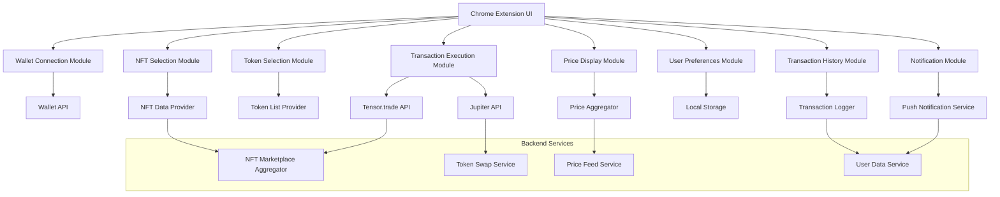

## Architecture for the NFT Liquidation Chrome Extension

1. Chrome Extension UI:
   This is the main interface that users interact with. It includes several modules:

   - Wallet Connection Module: Handles wallet integration and connection.
   - NFT Selection Module: Allows users to browse and select NFTs from their collection.
   - Token Selection Module: Provides options for users to choose the token they want to receive.
   - Price Display Module: Shows real-time prices and estimates.
   - Transaction Execution Module: Manages the liquidation process.
   - User Preferences Module: Stores and manages user settings.
   - Transaction History Module: Keeps track of past liquidations.
   - Notification Module: Handles alerts and confirmations.

2. External Integrations:
   - Wallet API: Integrates with Solana wallets like Phantom and Solflare.
   - NFT Data Provider: Fetches NFT metadata and ownership information.
   - Token List Provider: Supplies the list of available tokens for liquidation.
   - Price Aggregator: Gathers real-time price data from various sources.
   - Tensor.trade API: Used for NFT price discovery and sales.
   - Jupiter API: Handles token swaps.

3. Storage:
   - Local Storage: Used to store user preferences and cached data.

4. Backend Services:
   - NFT Marketplace Aggregator: Aggregates data from multiple NFT marketplaces.
   - Token Swap Service: Manages the token swap process.
   - Price Feed Service: Provides real-time price data for NFTs and tokens.
   - User Data Service: Manages user-specific data and settings.

5. Additional Components:
   - Transaction Logger: Keeps a record of all transactions.
   - Push Notification Service: Sends notifications to users.

